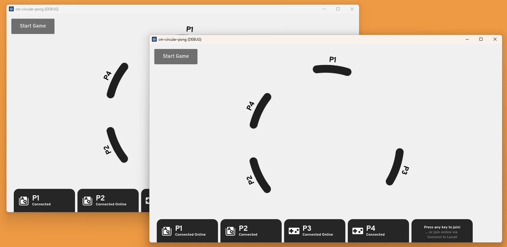

# Circular Pong

This is a "basic" Pong demo, it demonstrates flexible player joining capabilities of the framework.

Repository can be found [here](https://github.com/maji-git/cm-circular-pong). Clone the repo and give it a try! (or you can search up CM.gd in the Asset Store Templates to try it from the Godot Editor)

## How to play (two clients)

1. Enable Multiple Run Instances, set to 2 clients
2. Run the project
3. On the *first* client, Press the *Start* button
4. On the *first* client, Press any key to join as a player
5. On the *second* client, Press the *Connect to Local* button
6. On the *second* client, Press any key to join as a player
7. Press *Start Game* button on the top left to start the game

That's it, now you have 2 players visible on two clients! You can also bring in controllers, connect your controller and press any button to join as a controller player.