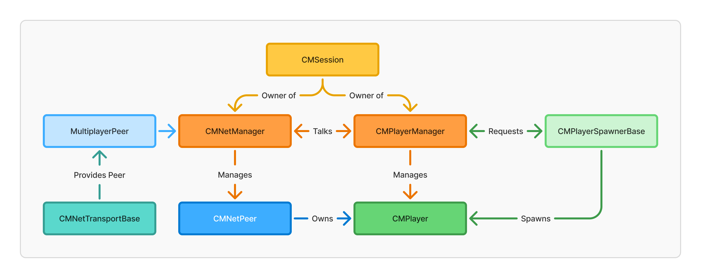

# How it works

Let's see how it works under the hood!

## Core Architecture Overview

- `CMSession` : Owner of everything CM. Used to link things together, and to keep things organized!

### Player Management

- `CMPlayerManager` : Manages Players, handling registering players (as requested by `CMNetManager`), and automatic player ID assignment.
- `CMPlayer` : Represents a player in the game, they can own a node that's in your scene. As spawned by `CMPlayerSpawnerBase`.
- `CMPlayerSpawnerBase` : An abstract class developers can override to define how player are spawned.

### Networking

- `CMNetManager` : Manages Networking, handling peer join requests, spawns player in the network. It uses `MultiplayerPeer` provided by `CMNetTransportBase`.
- `CMNetPeer` : Represents a peer in the network. Peer can own multiple `CMPlayer`.