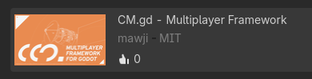
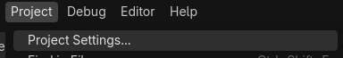
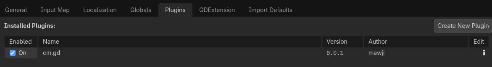
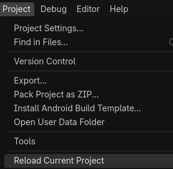
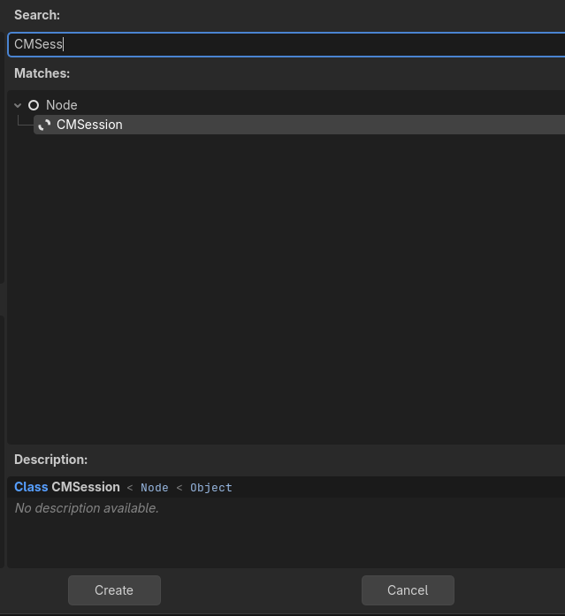
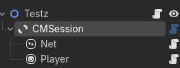
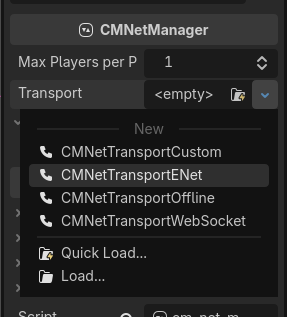

# Getting Started

Let's get started! This page will guide you through addon installation, enabling it, and setting it up in your scene.

## Getting the Addon

1. Go to the Asset Store Tab on the top of the editor
2. Search "*#CMGD*"
3. Install the CM.gd Addon

Additionally, the link to the Godot Asset Store is [here](https://store.godotengine.org/asset/mawji/cm-gd/).

## Enabling the Addon

1. Go to *Project > Project Settings*

2. Go to Plugins and Enable *cm.gd* Addon

3. At this point, I recommend you restarting the editor by going to *Project > Reload Current Project*. (Mainly because Godot bugs a little bit on newly installed addons)

## Adding CMSession

1. Add `CMSession` to your scene

2. Make sure `CMSession` is a child of the root node. The parent of the `CMSession` will be the root for all the multiplayer stuff.

## Configuring Transport

1. Select the node `Net` in CMSession
2. In the inspector dock. Choose the transport you'd like to use. (In this case, I'd recommend going with ENet first)

::: info
If the protocol you'd like to use is not listed here. You might want to use [Custom Transport](/transports/custom).
:::

Continue to the next page to configure player spawning.