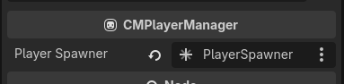

# Configuring Player spawner

In order to spawn the player, you'll need a Player Spawner first. To create one, create a new script that inherits `CMPlayerSpawnerBase`. Here's an example:

```gd
extends CMPlayerSpawnerBase
class_name PlayerSpawner

func spawn_player(plr: CMPlayer) -> Node:
	var splr := preload("res://local/testz.tscn").instantiate()
	splr.cm_plr = plr
	splr.set_multiplayer_authority(plr.net_peer.peer_id)
	add_child(splr, true)
	return splr

func despawn_player(plr: CMPlayer):
	plr.player_node.queue_free()
```

Notice that we assign `plr` into `splr.cm_plr`. `cm_plr` will be how your player node retrieve values and talk back to CM. The documentation will refer to this `cm_plr` in the next pages.

Next, create your new `PlayerSpawner` anywhere in the scene tree, then assign that spawner into CMSession → Player → `player_spawner`



::: info
If you cannot assign the spawner to Player. It's probably the Godot Editor's bug, reopen the scene and reassign again usually fixes it.
:::


## Adding a player

To add a player, call `CMPlayerManager.add_player_async()`. This will make a request to the server and return either `CMPlayer` or `null` if there's errors.

```gd
await player.add_player_async()
```

---

You would want to call this after hosting a server to create your first local player (unless you want server to be dedicated/headless)

```gd
net.start_server()
await player.add_player_async()
```

Or call this after connected to server to create the client's local player.

```gd
func _ready() -> void:
	net.server_connected.connect(_server_connected)
	net.start_client()

func _server_connected() -> void:
	await player.add_player_async()
```

You can create as many player as `CMNetManager.max_players_per_peer` allows you to per peer. They can be given a different controller device ID to control their own character. It's up to you!

Continue to the next page to get your game up and running!