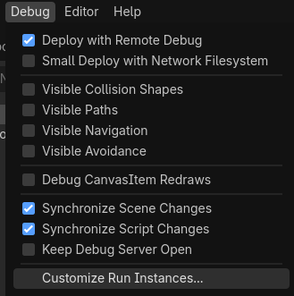
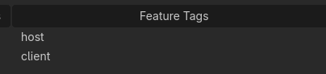

# Start Script

It's time to run your multiplayer game project! This page will guide you through how to get this working during development. Here's a basic script to get you started:

```gd
extends Node

@export var session: CMSession

func _ready() -> void:
	# Listen to the signals
	session.net.server_connected.connect(_server_connected)
	session.net.server_disconnected.connect(_server_disconnected)
	
	if OS.has_feature("host"):
		# Start the server and add player now
		session.net.start_server()
		await session.player.add_player_async()
	elif OS.has_feature("client"):
		# Start the client
		session.net.start_client()
	else:
		# Start singleplayer
		session.net.start_offline()
		await session.player.add_player_async()

func _server_connected() -> void:
	# Add player after connected to the server
	await session.player.add_player_async()
	print("[*] server connected")

func _server_disconnected() -> void:
	print("[x] server disconnected")
```

assign `CMSession` to the node. and then go to *Debug* > *Customize Run Instances...*


Toggle on *Enable Multiplayer Instances*, set the instance count to 2.


Then give each of the instance a Feature Tag "host" and "client"



Press Run, and you should have two instances running! A "[*] server connected" message should indicate that it's working!